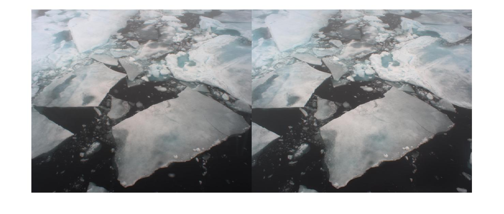
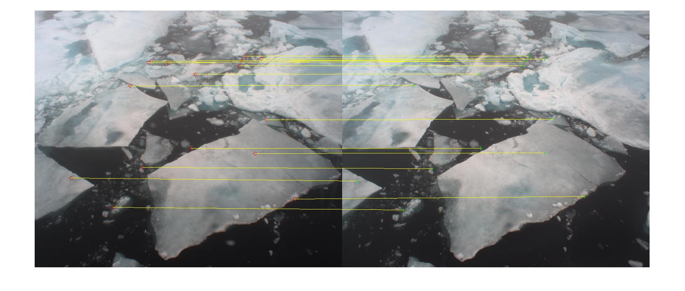
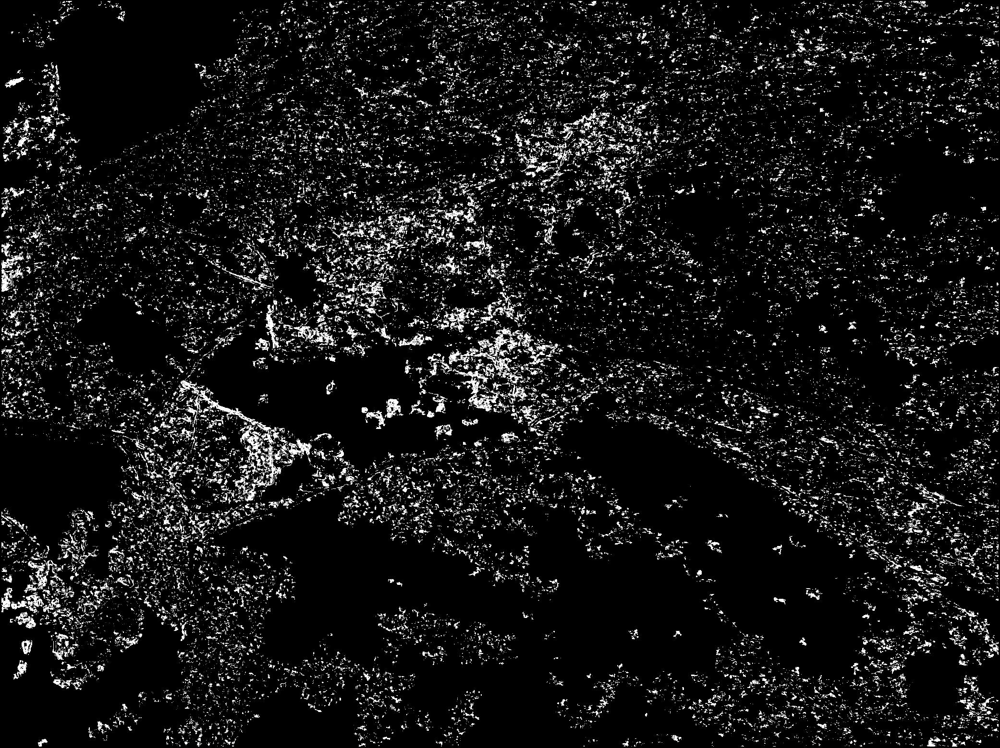
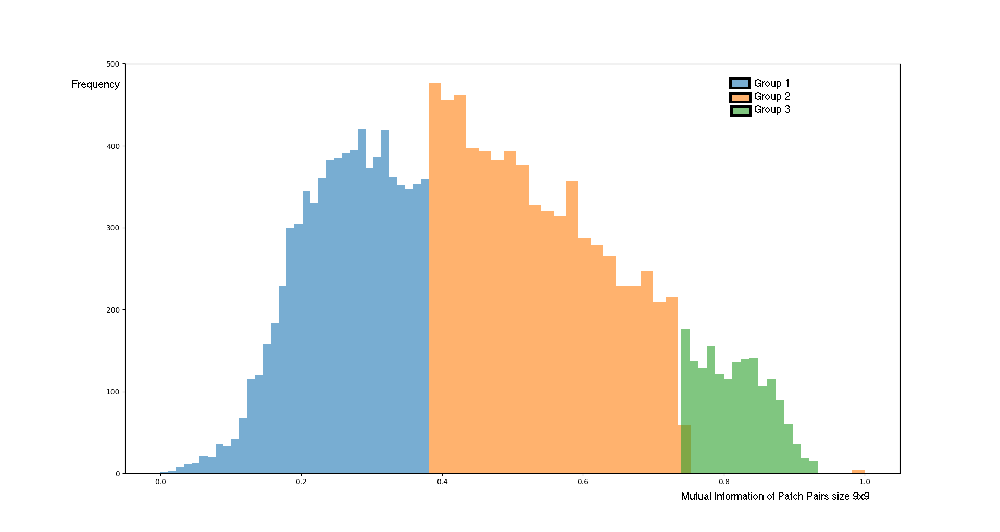
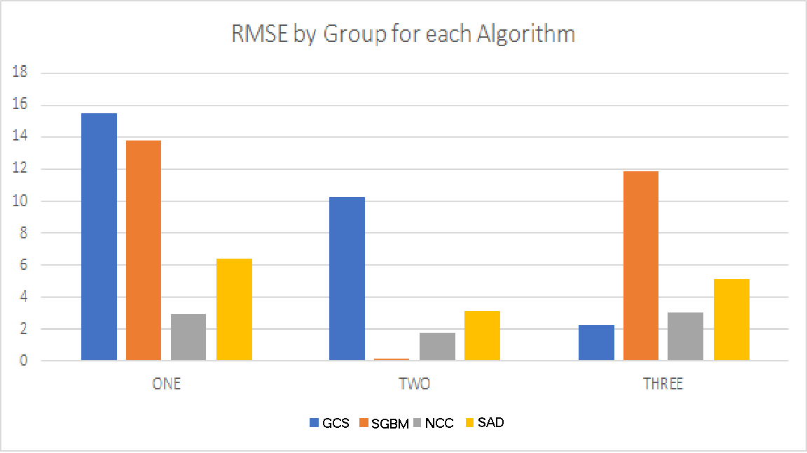

# Sea Ice Reconstruction
Requirements:
  1. Matlab 2019
  2. Python 3.x
  3. pytorch 1.0.0, texttable, numpy, cv2
  4. SIFT package for Matlab from http://www.vlfeat.org/install-matlab.html
  
  
 Data:
 Data is hosted here: http://vims.cis.udel.edu/psitres/psitres_db.php
 
 Usage:
 1. Download stereo image pairs from the repository 
 2. Get Rectification parameters by running the script: siftRectify_PARAMS.m
 3. Rectify the stereo image pair using the script: RECT_Images.m
 4. To generate ground truth for the stereo pair, run the script: getSIFTpts.m
 5. Run the scripts for estimating disparity maps (DISP*.m, DISP*.py)
 6. Estimate Mutual Information between stereo image pairs using: Patch_ALL.py
 7. Perform grouping of the patches extracted above, using Gaussian Mixture Model: Patch_GMM_Data.py
 8. Choose the best patch size and nuber of distributions by examining the output of above script
 9. Use the stereo algorithms to estimate the reconstruction of the groups according to previous output
 
 
 Examples :

   
    Left and Right Images from PSITRES
	 	 
		 
  
 	Matched Features after Rectification (only 20 matches shown for illustration)
	       
	
   
 	Disparity Map created from above input
	   
	       
   
  	Histogram of Patch Similarity using Normalized Mutual Information. 
Three regions per image are obtained using Gaussian Mixture Model on NMI scores of kernel pairs (9x9 size)

          
 
  	RMSE (Y-axis in pixels) error for each Algorithm by Group
	Result of applying stereo algorithms using above procedure
