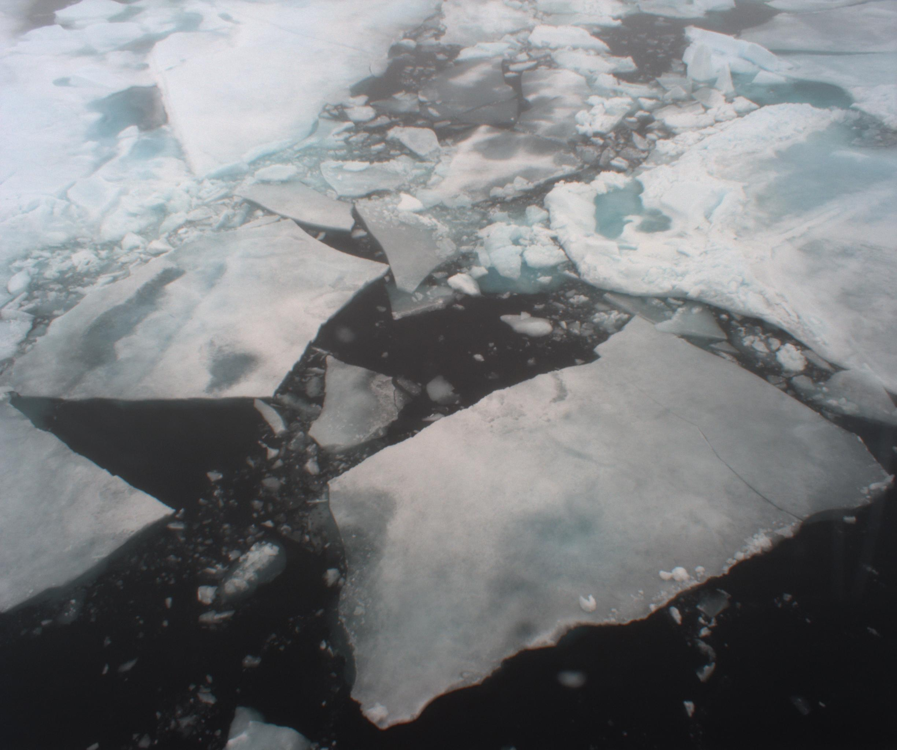
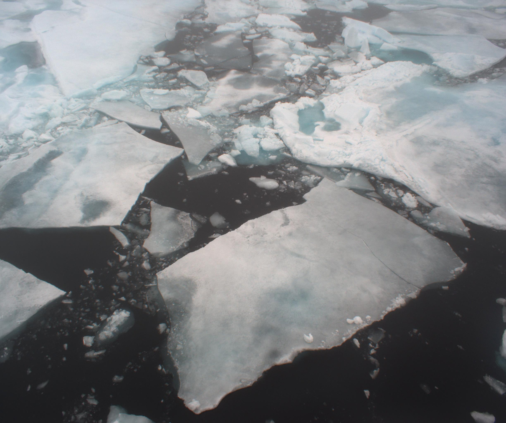

# Sea Ice Reconstruction
Requirements:
  1. Matlab 2019
  2. Python 3.x
  
  
 Data:
 
 Usage:
 
 Examples (Raw Images from PSITRES):

   
    Left Image from OATRC
  
    Right Image from OATRC
	 	 
  
  
	
